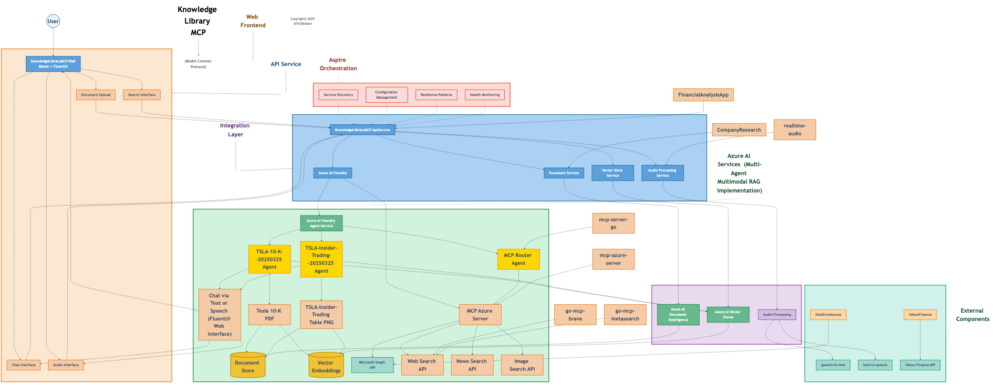

# Knowledge Library MCP

Knowledge Library MCP (KL-MCP) is a cloud-ready, distributed application built on .NET 9 Aspire and FluentUI that serves as a comprehensive document management and AI-powered search system designed to process, extract, and analyze information from various document types including financial reports, PDFs, images, and more.



## Key Features

- **Document Processing & Intelligence**: Extract and process content from various document formats (PDF, images, Office documents) using Azure AI Document Intelligence
- **Vector Store Management**: Store and manage document embeddings for semantic search capabilities
- **AI-Powered Search**: Find relevant information across your document library using semantic search
- **Agent-Based Interactions**: Interact with your documents through natural language using AI agents
- **Real-Time Audio Processing**: Speak queries and get audio responses with the audio quickstart tools
- **Modern UI**: Beautiful and responsive interface built with FluentUI components
- **Cloud-Ready Architecture**: Built on .NET 9 Aspire for cloud-native deployment

## System Architecture

Knowledge Library MCP is built using a modern, distributed architecture:

- **Web Frontend**: Blazor-based UI with FluentUI components (`KnowledgeLibraryMCP.Web`)
- **API Service**: RESTful API for document processing, vector operations, and agent communication (`KnowledgeLibraryMCP.ApiService`)
- **MCP Integration**: Integration with Model Context Protocol for advanced AI capabilities
- **Aspire Orchestration**: Cloud-native service discovery, configuration, and monitoring

## Updated System Architecture
The Knowledge Library MCP system is designed with a modular and distributed architecture to ensure scalability and maintainability. Below is a detailed breakdown of the architecture:

### Web Frontend
- **Components**:
  - **Document Upload**: Allows users to upload documents for processing.
  - **Search Interface**: Provides semantic search capabilities.
  - **Chat Interface**: Enables natural language interactions with documents.
  - **Audio Interface**: Supports voice-based queries and responses.
- **Technology**: Built using Blazor and FluentUI for a modern and responsive user experience.

### API Service
- **Core Service**: `KnowledgeLibraryMCP.ApiService` acts as the central hub for processing requests from the frontend.
- **Subservices**:
  - **Document Service**: Handles document processing and extraction.
  - **Vector Store Service**: Manages embeddings for semantic search.
  - **Azure AI Foundry**: Integrates with Azure AI services for advanced capabilities.
  - **Audio Processing Service**: Processes audio inputs and outputs.

### Integration Layer
- **Azure AI Document Intelligence**: Extracts structured data from documents.
- **Azure AI Vector Stores**: Stores and retrieves embeddings for semantic search.
- **Audio Processing**: Handles real-time audio interactions.

### Azure AI Services
- **Multi-Agent Multimodal RAG Implementation**:
  - **Dynamic Agents**: Specialized agents for tasks like analyzing financial reports or insider trading data.
  - **Chat Interface**: Supports text and speech-based interactions.
  - **MCP Azure Server**: Acts as a router for integrating external APIs like Microsoft Graph, Web Search, and News Search.

### External Components
- **Microsoft Graph API**: Provides access to organizational data.
- **Web Search API**: Enables web-based information retrieval.
- **News Search API**: Fetches relevant news articles.
- **Image Search API**: Retrieves images related to queries.

This updated architecture ensures a clean separation of concerns, leveraging Azure AI services and .NET Aspire for a robust and cloud-native solution.

## Architecture Diagram

Below is the architecture diagram for Knowledge Library MCP:


This diagram illustrates how the different components of the system interact, from the user interface through the API layer to the various services and data stores. The architecture follows a clean separation of concerns and leverages .NET Aspire for orchestration and management of distributed services.

## Prerequisites

- .NET 9 SDK (with Aspire workload)
- Azure Account (for AI services)
- Azure AI Document Intelligence service
- Azure AI Project resources

## Getting Started

### Installation

1. Clone the repository:
   ```bash
   git clone https://github.com/yourusername/Knowledge-Library-MCP.git
   cd Knowledge-Library-MCP
   ```

2. Configure Azure services in user secrets or environment variables:
   ```bash
   cd KnowledgeLibraryMCP/KnowledgeLibraryMCP.AppHost
   dotnet user-secrets set "DocumentIntelligence:Endpoint" "your-endpoint"
   dotnet user-secrets set "DocumentIntelligence:ApiKey" "your-api-key"
   dotnet user-secrets set "AzureAIProject:Endpoint" "your-endpoint"
   dotnet user-secrets set "AzureAIProject:ApiKey" "your-api-key"
   ```

3. Build and run the solution:
   ```bash
   dotnet run
   ```

4. Navigate to `https://localhost:5001` to access the application

### Usage Examples

#### Processing a Document

1. Navigate to the Document Upload section
2. Upload a PDF, image, or Office document
3. The system will process and extract content
4. View the processed content and embeddings

#### Searching Your Document Library

1. Navigate to the Search section
2. Enter your query or use voice input
3. View matching documents and relevant sections

#### Chatting with Document Agents

1. Navigate to the Chat section
2. Select a document or collection to chat about
3. Ask questions in natural language
4. Receive AI-generated responses based on your documents

## Integration with Other Components

Knowledge Library MCP integrates with several other components in this repository:

- **FinancialAnalysisApp**: Core document processing functionality adapted from this app
- **mcp-azure-server**: Uses this server for Model Context Protocol capabilities
- **realtime-audio-quickstart**: Incorporates audio processing capabilities for voice interactions
- **go-mcp-brave** and **go-mcp-metasearch**: Can leverage these for enhanced search capabilities

## Development Roadmap

- **Enhanced Document Processing**: Support for more document types and improved extraction
- **Advanced Search Capabilities**: Implement cross-document search and relationship mapping
- **Multi-modal Interactions**: Expand voice and potentially visual interaction capabilities
- **Mobile Support**: Responsive design for mobile access
- **Deployment Automation**: CI/CD pipelines for Azure deployment

## Contributing

Contributions are welcome! Please feel free to submit a Pull Request.

## License

This project is licensed under the MIT License - see the LICENSE file for details.

## Acknowledgments

- Microsoft Azure AI services
- .NET Aspire team for the cloud-native application framework
- FluentUI team for the component library

## Technologies Used

The Knowledge Library MCP project leverages the following technologies:

- **.NET 9.0**: For building the web and API services.
- **Azure AI Services**: For document intelligence and vector store management.
- **Mermaid.js**: For generating architecture diagrams.
- **Node.js and npm**: Required for running the Mermaid CLI.
- **Python**: Used in the `mcp-azure-server` for additional backend services.
- **Go**: Used in `go-mcp-brave` and `go-mcp-metasearch` for specific microservices.
- **Fluent UI**: For building modern and responsive web components.
- **Markdig**: For Markdown processing.
- **Bash**: For automation scripts like `update_architecture_diagram.sh`.

This combination of technologies ensures a robust, scalable, and user-friendly system.

### Technologies Used in `Home.razor`

The `Home.razor` component in the Knowledge Library MCP project utilizes the following technologies:

- **Blazor**: For building interactive web UI components.
- **Fluent UI**: For modern and responsive web components, such as cards, buttons, and progress indicators.
- **Azure AI Services**: For integrating document intelligence and vector store management.
- **Markdig**: For converting Markdown content to HTML.
- **Microsoft.JSInterop**: For JavaScript interop in Blazor components.
- **C#**: For backend logic and Razor component development.

These technologies enable a seamless and user-friendly experience in the `Home.razor` component, supporting features like file uploads, progress tracking, and AI-powered interactions.

### Multimodal Capabilities

The Knowledge Library MCP project is designed to be multimodal, enabling it to process and analyze various types of data, including:

- **Text**: Extract and analyze information from documents such as PDFs, Word files, and plain text.
- **Images**: Process and extract data from images, including charts and tables.
- **Audio**: Handle real-time audio queries and responses using the audio processing tools.
- **Live Data**: Integrate live data sources, such as stock prices and financial updates, for dynamic insights.

This multimodal approach ensures that the system can handle diverse data types, providing a comprehensive and versatile solution for document and data management.

### Document Intelligence for Images

The Knowledge Library MCP project leverages the **Azure Document Intelligence** service to process and analyze images. This includes:

- Extracting text and structured data from images, such as charts, tables, and scanned documents.
- Converting image-based content into searchable and analyzable formats.
- Supporting multimodal capabilities by integrating image data with text and live data sources.

This integration ensures that the system can handle image-based documents seamlessly, providing a comprehensive solution for document and data management.

### Azure AI Foundry with GPT-4o

The Knowledge Library MCP project integrates **Azure AI Foundry** with **GPT-4o** to enhance its AI capabilities. This includes:

- **Multimodal AI**: Leveraging GPT-4o for processing both text and image-based data.
- **Advanced Natural Language Understanding**: Enabling sophisticated interactions with documents through natural language queries.
- **Seamless Integration**: Combining Azure AI Foundry's managed services with GPT-4o's multimodal capabilities for a robust and scalable solution.

This integration ensures that the system can handle complex queries and provide accurate, context-aware responses across various data types.