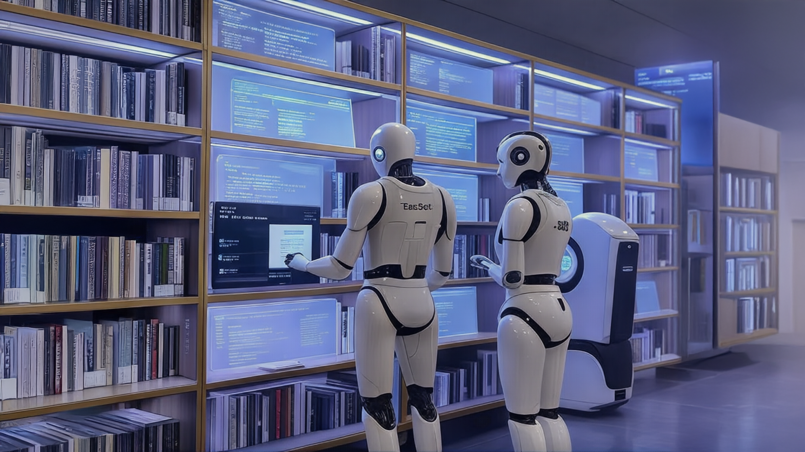
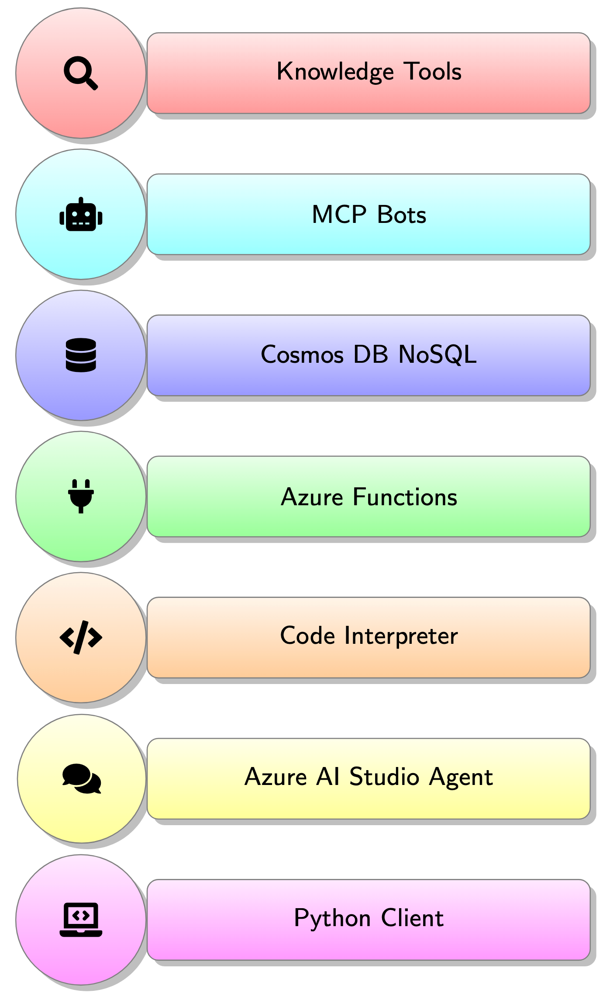
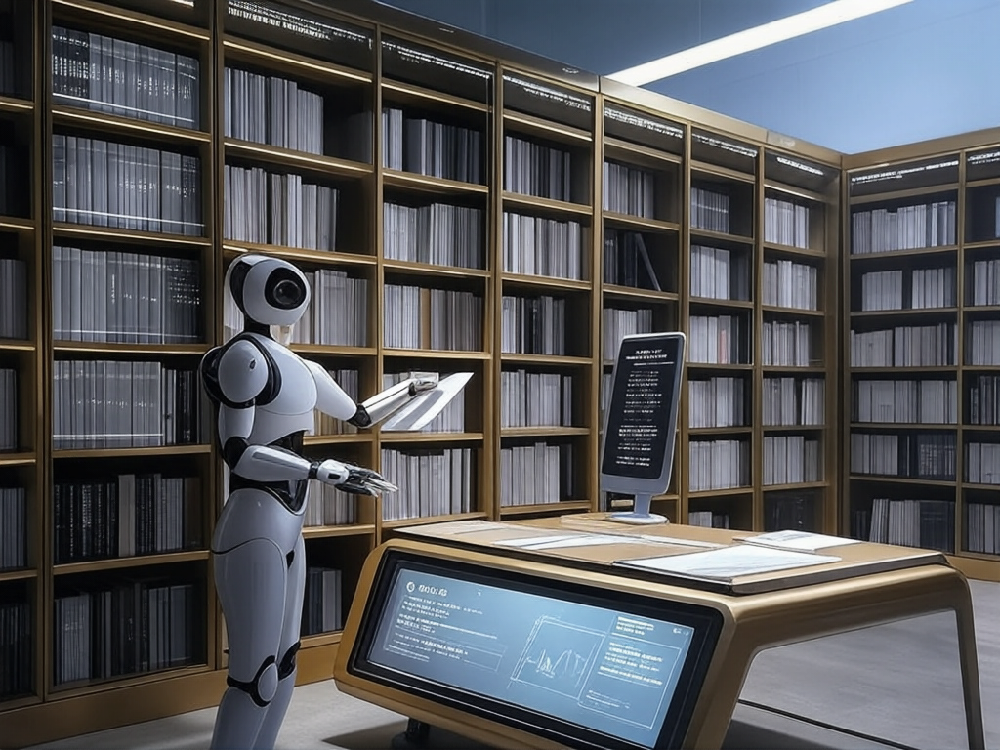
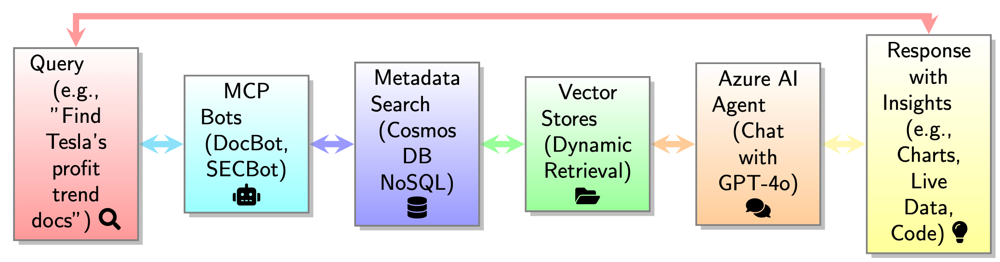

# Project Story

## About the Project

**Knowledge Library MCP (KL MCP)** is a multi-modal app I developed to tackle the chaos of managing thousands of documents—Machine Learning files, SEC filings like TSLA 10-Ks and 10-Qs, process workflows, and charts—by finding them fast and enabling chat-based querying with Azure AI Agent Service. Below, I’ll share what inspired me, what I learned, how I built it, and the challenges I faced.

  
*The library-like architecture of KL MCP, powered by Azure AI Agent Service and MCP bots.*

## Inspiration

My inspiration came from wrestling with documentation overload as a developer—hours lost digging through PDFs, Excel sheets, and charts just to find the right info. Anthropic’s Model Context Protocol (MCP) caught my eye, showing how context could unlock insights from scattered data. I initially tried chunking documents and vectorizing them in Cosmos DB NoSQL, but as the pile grew, it became impossible to pinpoint specifics. I envisioned a smarter system, like a library, to organize and chat with documents using Azure’s AI tools—multi-modal, scalable, and responsible—turning frustration into a hackathon challenge worth solving.

  
*My early attempts at managing documentation chaos inspired a library-like solution.*

## What it does

KL MCP finds documents across text and images—like ML pipelines, financial filings, and workflows—then lets me chat with them to extract insights. It processes PDFs, Word, Excel, PowerPoint, text files, HTML, and images (via OCR/labels), using Azure AI Agent Service’s language smarts to answer queries like “What’s the revenue outlook?” or “Optimize this process?” My bot-driven system outscales Azure AI Search, blending live data and code-driven insights for a seamless, chat-ready experience.

  
*KL MCP finds documents and enables chat-based querying across text and images.*

## How we built it

I built KL MCP solo, leveraging Azure AI Agent Service’s ecosystem and using GitHub Copilot extensively to accelerate coding and refine logic:

- **Knowledge Tools with MCP Bots:** I coded a hierarchical system—DocBot for ML/workflows, SECBot for filings—where one agent oversees domains like TSLA or ML docs. With Copilot’s help, my scripts upload files into vector stores, while Cosmos DB NoSQL stores metadata (e.g., type, date), vectorized for semantic search. Text and images are processed with precision, dynamically attached for chat—unlike Search’s static indexes.
- **Azure Functions:** Copilot assisted in scripting API calls (e.g., stock prices) for live data, fixing RAG’s stale-data issue.
- **Code Interpreter:** I used Copilot to write Python code that crunches data or plots visuals—like profit trends—enhancing chat responses.
- **Azure AI Studio Agent:** With Copilot’s suggestions, I set up a GPT-4o agent, coded it to “Find files, call functions, run code, and chat,” integrating multi-modal insights with Responsible AI.
- **C# Client:** Copilot streamlined my coding of a lean app to manage it all—uploading, threading, querying—via the Azure AI Agents SDK.

## Challenges we ran into

Scaling was the biggest hurdle—my initial Cosmos DB NoSQL chunking couldn’t handle thousands of files without losing precision. Mapping a library-like hierarchy to Azure’s tools took trial and error; syncing metadata in Cosmos DB NoSQL with vector stores was complex. Integrating live data and code outputs while upholding Responsible AI standards—fairness, transparency—pushed my skills, but Copilot and debug cycles helped me overcome these obstacles.

## Accomplishments that we're proud of

I’m proud of crafting a multi-modal app that seamlessly handles text and images—finding a TSLA 10-K’s chart and chatting about its trends in seconds. Outscaling Azure AI Search with my bot-driven system is a big win, as is blending live data and code insights—all while embedding Responsible AI. Seeing it solve real developer pain points is a thrill.

  
*A screenshot of KL MCP chatting about a TSLA 10-K chart, blending text and image insights.*

## What we learned

I learned Azure AI Agent Service’s strength for multi-modal apps—text and image processing with language smarts is transformative. Hierarchical systems beat flat indexes for scale, and Responsible AI is a mindset, not just a feature. Using GitHub Copilot extensively taught me how AI can boost coding efficiency, while designing a library-like structure sharpened my metadata and integration skills.

## What's next for Knowledge Library MCP

Next, I’ll expand KL MCP to include voice/audio for dictating queries or video/motion for animated workflows, broadening its multi-modal scope. I’ll refine the bot system with smarter domain logic, enhance metadata with AI-driven tagging, and integrate Azure Machine Learning for predictive insights—all while upholding Responsible AI.

---